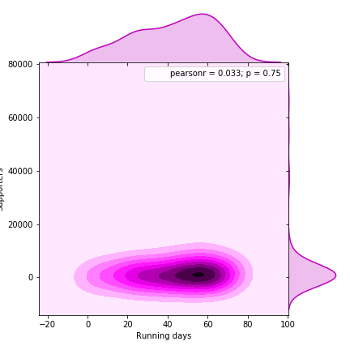
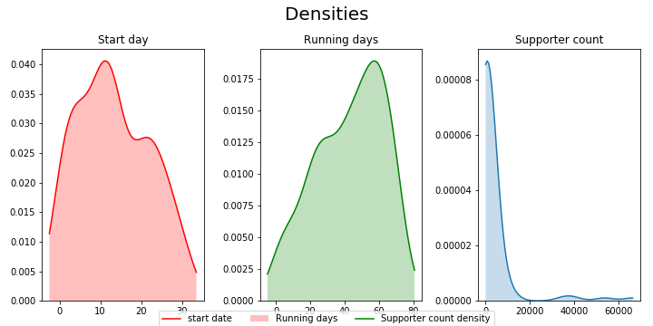

# Scraping borgerforslag.dk

Borgerforslag.dk is a website where danish citizens an submit and vote on policy suggestions. Any suggestion that reaches more than 50.000 votes is to be debated in the danish Parliament.

Make sure to get the STATUSDATA.pickle file if you use this repo. There are a lot of gaps in the ordering of suggestion urls (i.e. theres a http://.../FT-00005 but the next in line is FT-00034), STATUSDATA.pickle contains information on which html's actually contain a suggestion, speeding up scraping significantly.

## TODO

* Get the scraper to work on the few remaining cases where it doesn't work.
* Update the scraper to produce panel data

# Results
First of all it's interesting that there is little correlation between the number of days a suggestion has been running, and the support is has gathered - in other words campaigns are bad at creating sustained awareness, or reaches all likeminded individuals very early.

Also it is not completely random which day of the month the suggestions as submitted, although this might be because the website is quite new. The supporter count is near 0 in almost all cases. 

